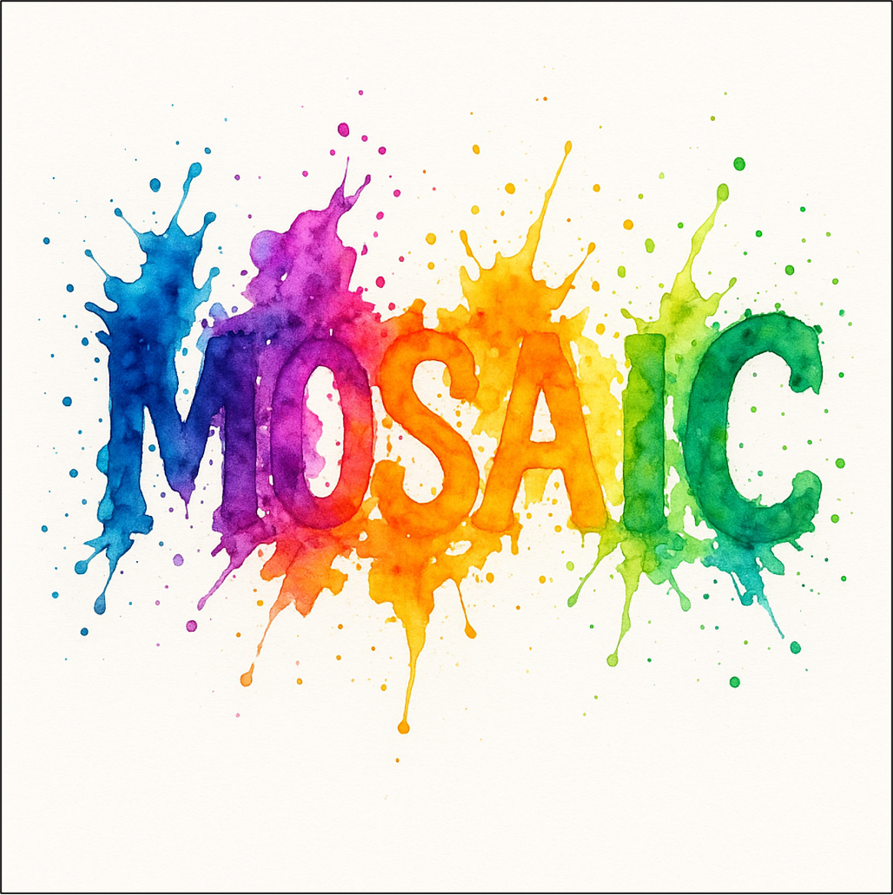

<h3 align="center">
    
    MOSAIC: Multi-Subject Personalized Generation via Correspondence-Aware Alignment and Disentanglement
</h3>

<p align="center"> 
<a href="https://bytedance-fanqie-ai.github.io/MOSAIC/"></a> 
<a href="https://arxiv.org/abs/2509.01977v1"></a>
<a href="https://huggingface.co/ByteDance-FanQie/MOSAIC"></a>
<a href="https://huggingface.co/datasets/ByteDance-FanQie/SemAlign-MS-Subjects200K"></a>
</p>


<p align="center"> 
  <a href="https://scholar.google.com/citations?user=DcVoflUAAAAJ&hl=zh-CN&oi=ao"><span style="color:#137cf3; font-family:Gill Sans">Dong She<sup>*</sup></span></a>, 
  <a href="https://scholar.google.com/citations?user=tql_Zc4AAAAJ&hl=zh-CN&oi=ao"><span style="color:#137cf3; font-family:Gill Sans">Siming Fu<sup>*</sup></span></a>, 
  <a href="https://scholar.google.com/citations?user=-WUyWpMAAAAJ&hl=zh-CN&oi=ao"><span style="color:#137cf3; font-family:Gill Sans">Mushui Liu<sup>*</sup></span></a>, 
  <a href="https://scholar.google.com/citations?user=zWQf0XcAAAAJ&hl=zh-CN&oi=ao"><span style="color:#137cf3; font-family:Gill Sans">Qiaoqiao Jin<sup>*</sup></span></a>, 
  <a href="https://scholar.google.com/citations?user=4lzd8NsAAAAJ&hl=zh-CN&oi=ao"><span style="color:#137cf3; font-family:Gill Sans">Hualiang Wang<sup>*</sup></span></a>,  
  <br> 
  <span style="color:#137cf3; font-family:Gill Sans">Mu Liu</span></a>, 
  <span style="color:#137cf3; font-family:Gill Sans">Jidong Jiang<sup>+</sup></span></a> 
  <br>
  <span style="font-size: 16px">Fanqie AI Team, ByteDance</span>
</p>


## 🔥 News
- **2025-09-30**: 🔥 Release training/inference codes and [models](https://huggingface.co/ByteDance-FanQie/MOSAIC)(resolution 512x512). The vision of resolution 1024x1024 is coming soon.
- **2025-09-30**: 🔥 Release the [SemAlign-MS-Subjects200K](https://huggingface.co/datasets/ByteDance-FanQie/SemAlign-MS-Subjects200K) dataset 
- **2025-09-02**: The [arXiv paper](https://arxiv.org/abs/2509.01977v1) of MOSAIC is released.
- **2025-08-20**: The [project page](https://bytedance-fanqie-ai.github.io/MOSAIC/) of MOSAIC is released.

## 📖 Introduction

We present <b>MOSAIC</b>, a representation-centric framework that rethinks multi-subject generation through explicit semantic correspondence and orthogonal feature disentanglement. Our key insight is that multi-subject generation requires precise semantic alignment at the representation level—knowing exactly which regions in the generated image should attend to which parts of each reference. 
<p align="center">

</p>
MOSAIC introduces two key supervisions: (1) <b>Semantic Correspondence Attention Loss</b> (blue region) enforces precise point-to-point alignment between reference tokens and their corresponding locations
in the target latent, ensuring high consistency; (2) <b>Multi-Reference Disentanglement Loss</b> (green region) maximizes the divergence between different references’ attention distributions, pushing each subject into orthogonal representational subspaces.

## ⚡️ Quick Start

### 🔧 Requirements and Installation

Install the requirements
```bash
conda create -n mosaic python=3.10 -y
conda activate mosaic
pip install -r requirements.txt
```

### ✍️ Inference
```bash
python inference.py 
```
It will download the Flux-dev model and the MOSAIC checkpoints, then execute the pre-configured demo case. You are then encouraged to experiment and create your own unique outputs by edit [example_cases.json](example_cases.json).


### 🚄 Training
1. Train with the [SemAlign-MS-Subjects200K](https://huggingface.co/datasets/ByteDance-FanQie/SemAlign-MS-Subjects200K) dataset
```bash
huggingface-cli download --repo-type dataset ByteDance-FanQie/SemAlign-MS-Subjects200K --local-dir your_data_folder/SemAlign-MS-Subjects200K
```

2. Train with customized dataset.
To set up the preprocessing environment, first download the [DIFT](https://github.com/Tsingularity/dift) and [GeoAware](https://github.com/Junyi42/GeoAware-SC) codebases. Next, integrate our preprocessing scripts by copying [dift_point_matching.py](preprocess/dift_point_matching.py) and [geoaware_point_matching.py](preprocess/geoaware_point_matching.py) into their respective directories. You can then run these scripts to generate Semantic Correspondence for your own dataset. Then you could train the code by `bash train.sh`

## TODO
To support research and the open-source community, we will release the entire project—including datasets, inference pipelines, and model weights. Thank you for your patience and continued support! 🌟
- ✅ Release arXiv paper.
- ✅ Release tarining and inference codes.
- ✅ Release the SemAlign-MS-Subjects200K dataset.
- ✅ Release model checkpoints (512x512).
- ⬜ Release model checkpoints (1024x1024).
- ⬜ Release the multi-subject driven dataset generation pipeline.

<!-- ✅ -->

## Citation
```
@misc{she2025mosaicmultisubjectpersonalizedgeneration,
      title={MOSAIC: Multi-Subject Personalized Generation via Correspondence-Aware Alignment and Disentanglement}, 
      author={Dong She and Siming Fu and Mushui Liu and Qiaoqiao Jin and Hualiang Wang and Mu Liu and Jidong Jiang},
      year={2025},
      eprint={2509.01977},
      archivePrefix={arXiv},
      primaryClass={cs.CV},
      url={https://arxiv.org/abs/2509.01977}, 
}
```